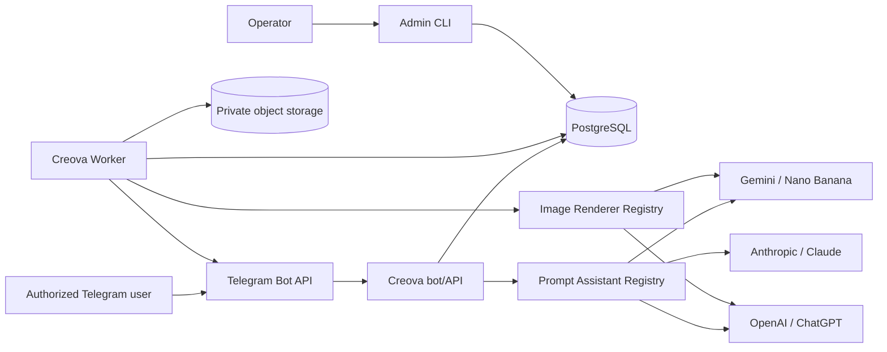

# Architecture

## 1. Style

Creova is a modular monolith with hexagonal boundaries and separate runtime roles:

- `bot-api`: Telegram transport, access checks, conversation commands, callbacks, and health endpoints;
- `worker`: prompt-assistant calls when asynchronous, image generation, storage, delivery, reconciliation, and cleanup;
- `admin-cli`: allowlist, quota, provider-health, and operational administration.

PostgreSQL is the system of record. S3-compatible storage holds private images. Telegram is the only user interface.

## 2. Context



## 3. Capability separation

The architecture separates two provider roles:

### Prompt assistant

Produces structured creative analysis, missing-detail questions, a normalized brief, and an optimized renderer-aware prompt.

Supported labels:

- `nano_banana` through Gemini;
- `chatgpt` through OpenAI;
- `claude` through Anthropic.

### Image renderer

Produces image bytes from a confirmed generation specification.

Supported labels:

- `nano_banana` through Gemini image generation;
- `chatgpt` through OpenAI image generation.

Claude is not registered in the image renderer registry. This is enforced by types, configuration validation, UI choices, and tests.

## 4. Dependency direction

```text
presentation -> application -> domain
infrastructure -> application ports and domain
bootstrap -> all layers for composition only
```

Provider SDKs are infrastructure details. The domain knows only owned enums, value objects, capabilities, and errors.

## 5. Conversation state machine

```text
new
 -> awaiting_provider
 -> collecting_initial_prompt
 -> refining_brief
 -> awaiting_renderer       # required when Claude is assistant
 -> awaiting_confirmation
 -> queued
 -> generating
 -> completed | failed | cancelled | expired
```

Conversation state is durable, versioned, and expires after a configurable TTL. Every callback includes a compact action and draft version; the server reloads and authorizes the draft before applying it.

## 6. Refinement cycle

1. Persist the initial prompt and provider choice.
2. Ask the selected prompt assistant for a schema-constrained `BriefAssessment`.
3. Merge only validated fields into the draft.
4. If a material unknown remains and the question limit is not reached, send one question.
5. Persist the user answer as a conversation turn.
6. Reassess the brief.
7. When ready, produce a renderer-aware optimized prompt.
8. Present review and confirmation controls.

The assistant may recommend defaults but must not silently overwrite explicit user constraints.

## 7. Confirmation boundary

Generation is a separate use case from refinement. The confirm command must:

- re-authorize the user;
- lock or compare the draft version;
- validate assistant and renderer availability;
- validate that Claude is not the renderer;
- validate required brief fields and policy;
- reserve quota and budget;
- create one generation request and one durable job;
- emit audit and notification outbox records;
- commit atomically.

Only the worker may call an image renderer.

## 8. Credential architecture

- `CREOVA_TELEGRAM_BOT_USERNAME=FeloCreova_bot` is public configuration.
- `CREOVA_TELEGRAM_BOT_TOKEN` is secret configuration injected at runtime.
- `CREOVA_GOOGLE_API_KEY`, `CREOVA_OPENAI_API_KEY`, and `CREOVA_ANTHROPIC_API_KEY` are optional provider secrets.
- Provider menus are built from configured, healthy capabilities.
- Secret values never enter domain objects, database rows, logs, metrics, or prompts.
- Production uses a secret manager and workload identity where available.

## 9. Telegram update processing

1. Validate webhook secret or polling runtime ownership.
2. Enforce body and update-type limits.
3. Insert unique Telegram `update_id`.
4. Reject duplicate updates as successful no-ops.
5. Require private chat and authorize numeric user ID.
6. Translate the update into an application command.
7. Persist state and enqueue any asynchronous work.
8. Reply or edit the Telegram message.
9. Return without waiting for image generation.

## 10. Worker and idempotency

PostgreSQL provides the initial durable queue using `FOR UPDATE SKIP LOCKED`, leases, bounded retries, and reconciliation.

Idempotency keys cover:

- Telegram `update_id`;
- callback action plus draft version;
- confirmation command;
- provider submission fingerprint;
- stored asset key and SHA-256 digest;
- delivery notification.

A retry must resume or return an existing operation rather than create a second billable image.

## 11. Storage and delivery

The worker validates MIME type, byte limit, dimensions, and digest before making an asset available. Storage keys use non-guessable internal IDs. Telegram delivery is preferred; signed links are short-lived and generated only after authorization.

The final Telegram message includes the image metadata and the future-publishing notice. The publishing notice is presentation text, not a publishing event or integration.

## 12. Future boundary

A future social-publishing module may consume a versioned `content.ready.v1` event. The current MVP stores no social account, platform token, publication schedule, caption draft, or publishing attempt.
